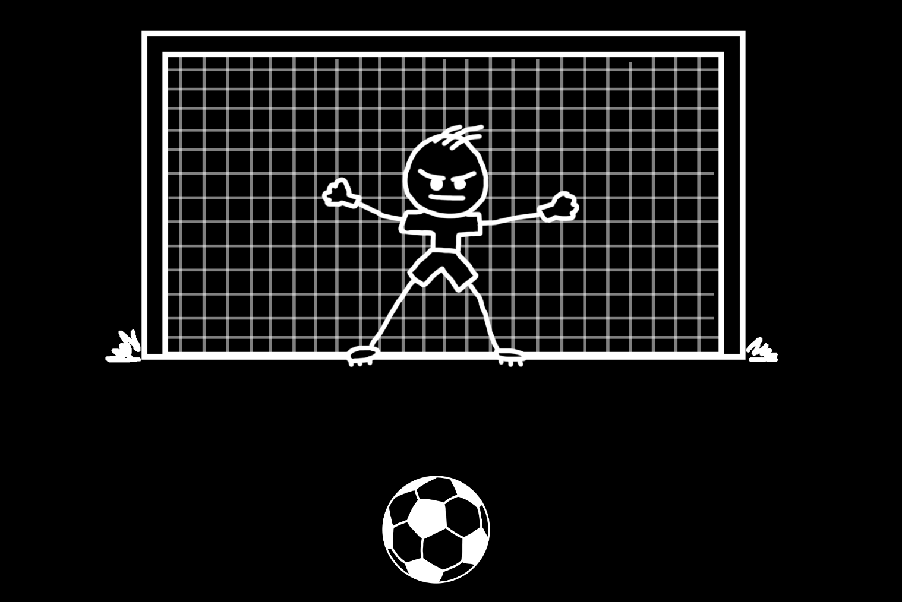
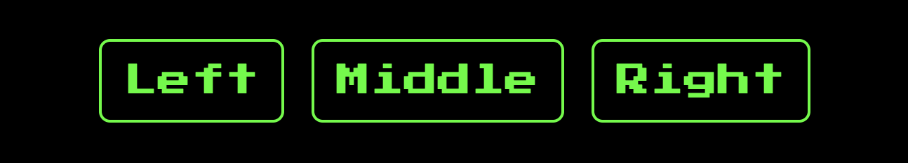
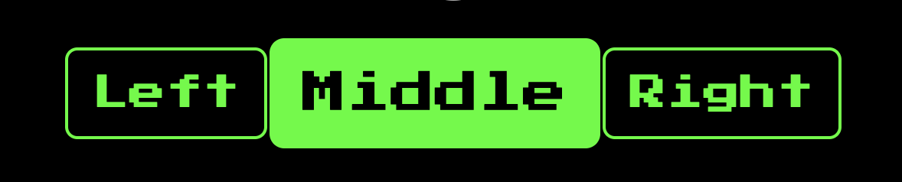
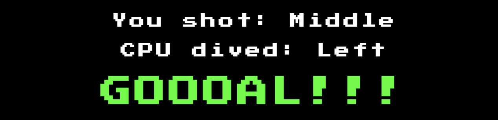
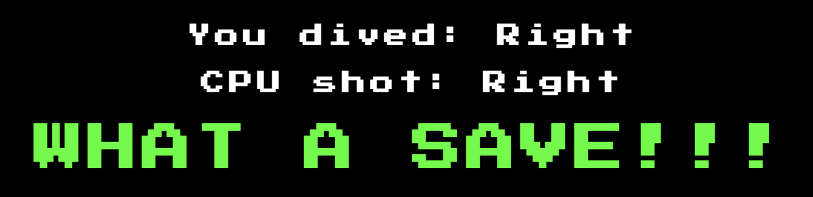
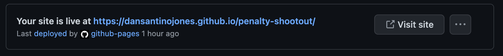

# Penalty Shootout

Penalty Shootout is a game of chance created to provide entertainment for football fans. The art style is retro arcade to provide a nostalgic feel to old school gaming whislt keeping the concept simple and easy to play. 

## Business Goals
* Provide entertainment to online users through a game of chance.
* Create a game that is easy to play and understand.
* Create a retro style game.

## User Goals
* To play the game and outscore the goalkeeper.

# UX
## Strategy 
Following the core UX principles I firstly decided on the target audience of users and I put myself in their shoes to what features I would want.

### Target Audience:
* Aged 5-30.
* Football fans.
* Enjoys playing games. 

### What the user would want from the website:
* Multiple choice.
* Element of chance.
* Score tracking. 

### This website is best for users: 
* Retro art style. 
* Simple game mechanics.
* Easy to understand and play.
* Simple asthetics.

## Scope
To achieve the strategic goals, I included the following features:
* Header with retro gaming font.
* Scoreboard with points tracker.
* Cartoon style goal and goalkeeper.
* Cartoon style retro football.
* Retro style buttons with hover effect.
* A results section.
* Responsive alert.

## Structure
I decided it would be best to keep the game on a single page as this would keep it easy to play and understand acheiving the business goals. The initial structure of the page followed title > goal > ball > direction buttons > score with an alert popping up on screen with the outcome. However, this was slightly changed to prioritise important information such as the score and result.

## Skeleton
I created wifreframes using [Balsamiq](https://balsamiq.com/). Please note the website has slightly changed since creating the wireframes.

## Surface 
The colours used for the website were chosen to acheive the goals of simplicity and retro gaming style. The green colour was used to highlight the important aspects of the website such as the main heading, result and score. The colours used passed the [Colour Contrast Accessibility Validator](https://color.a11y.com/).

I decided to use the Start Press 2P font from [Google Fonts](https://fonts.google.com/) as this provide a retro gaming style to the webpage acheiving the business goals.

A hover effect was used on the choices buttons. A scale and colour change was used to highlight the buttons and users options.

# Features
## Title 
The title is used for branding purposes. The name was chosen to specify what type of game it is whilst using the Start Press 2P font for a retro design.

## Scoreboard
The scoreboard is placed towards the top of the screen so it is easily visable to the user at all times. The colour green is used to highlight the scores. The numbers increases every time a goal is scored and helps the user keep track of the score.

## Image 
The cartoon image was designed using [Adobe Photoshop](https://www.adobe.com/uk/products/photoshop.html) to help the user visualise the game whilst playing. 

## Buttons
The 'Left', 'Middle' and 'Right' buttons are created so the user can chose which direction they are shooting and diving. The hover effect was used to scale and change the colours of the buttons highlighing the importance of the users choice.

## Results 
The result section firstly displays which direction the user shot or dived depending if it is the users turn. A larger alert is displayed depending is a goal was scored or saved. This builds dramatic effect and is highlighted in green so demonstrate the importance. 

## Features Left To Implement
I believe the website has plently of opportunities to develop and improve in the future. The features I would like to implement going forward are:

* Background music.
* Online multiplayer.
* Animate ball. 
* Animate goalkeeper.

# User Stories
1. As a user I want to play a game that involves an element of chance.
* The design is a game of chance, therefore there is an element of luck to winning.

2. As a user I want to play a game that is simple and easy to follow.
* There are simple game mechanics implemented. The user is prompted with when to shoot and when to save making the game easy to follow.

3. As a user I want the game to track the score.
* The scoreboard was designed to keep track of the users and computers goals scored.

4. As a user I want the to know the decision of the computer.
* The results section lets the user know which direction they and the computer chose and the outcome.  

5. As a user I want a game that is mobile friendly to play on the go.
* The game was designed mobile-first as most users will be playing via mobile phone. 

6. As a user and a football fan I want the game to resemble a real life penalty shootout.
* The user takes turns against the computer to shoot and save. The score increasing every time a goal goes unsaved.

## Technologies Used
[HTML](https://developer.mozilla.org/en-US/docs/Web/HTML)
* HTML was used as the building block of the projects content and structure.

[CSS](https://developer.mozilla.org/en-US/docs/Learn/Getting_started_with_the_web/CSS_basics)
* CSS was used to style the web content across the page.

[JavaScript](https://developer.mozilla.org/en-US/docs/Web/JavaScript)
* JavaScript was used to create the functions and game mechanics.

[Adobe Photoshop](https://www.adobe.com/uk/products/photoshop.html)
* Adobe Photoshop was used to design the goal, goalkeeper and ball.

[Favicon](https://favicon.io/)
* Favicon was used to create a favicon for the website.

[Github](https://github.com/)
* GitHub was used to store the code for the project.

[Git](https://git-scm.com/)
* Git was used for version control to commit and push to GitHub.

[Gitpod](https://www.gitpod.io/)
* Gitpod was used as the development environment.

[Google Developer Tools](9https://developer.chrome.com/docs/devtools/)
* Google Developer Tools (devtools) was used to fix errors and test responsivness.

[Python JavaScript Code Visualizer](https://pythontutor.com/visualize.html#mode=edit)
* Python JavaScript Code Visulaizer was used to test functions and game mechanics.

[Balsamiq](https://balsamiq.com/)
* Balsamiq was used to create wireframes.

[Colour Contrast Accessibility Validator](https://color.a11y.com/)
* Used this to test the colour contrast of the backgrounds and fonts.

[W3C Markup Validation Service](https://validator.w3.org/)
* W3C Validator was used to validate the HTML code.

[W3C CSS Validation Service](https://validator.w3.org/#validate_by_input)
* W3C Validator was used to validate the CSS code.

[Am I Responsive](https://ui.dev/amiresponsive)
* Am I Responsive was used to obtain final images of my website across different device sizes.

[Responsively](https://responsively.app/)
* Responsively App was used to test website across different screen sizes. 

[Lucidcharts](https://www.lucidchart.com/pages/)
* Lucidcharts was used to visulise if statements.

## Deployment
I followed the steps below to deploy my webpage:

1. Log into GitHub.
2. Select project repository you want to deploy.
3. Select 'Settings' in the menu at the top.
4. Select 'Pages' on the left side menu.
5. In the scource section, select branch 'Master' and save.
6. The page will produce your websites URL as seen below.

# Credits 

## Code
* General coding queries were answered by [W3School](https://www.w3schools.com/).
* Assistance with JavaScript code from [Ania Kubów](https://www.youtube.com/watch?v=RwFeg0cEZvQ).

## Content
* The Favicon used was from [Favicon](https://favicon.io/).

## Media 
* Images were created using [Adobe Photoshop](https://www.adobe.com/uk/products/photoshop.html).

# Acknowledgements
I would like to thank my course mentor Guido Cecilio for his support and guidance on this project.