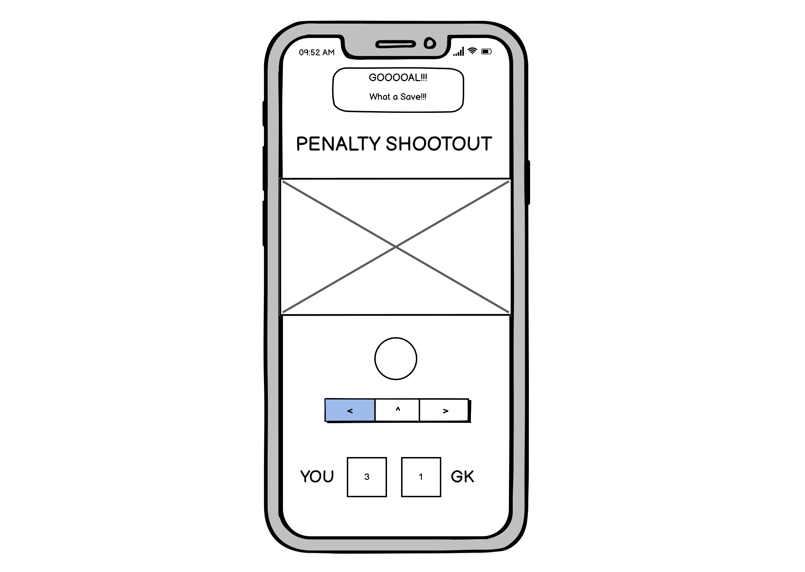
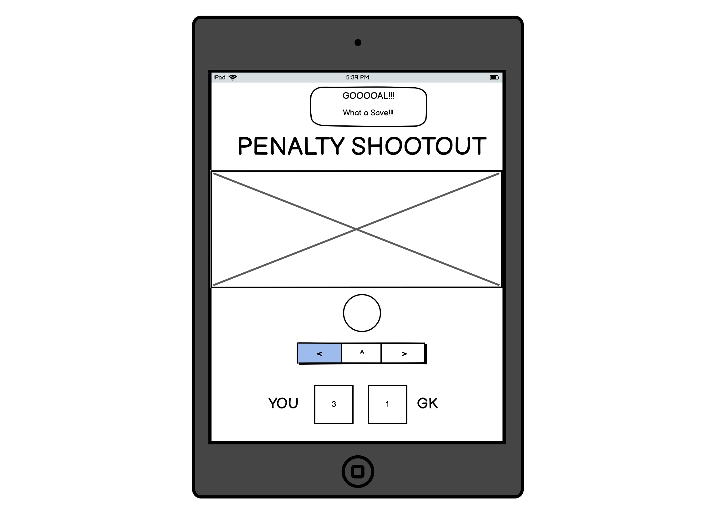
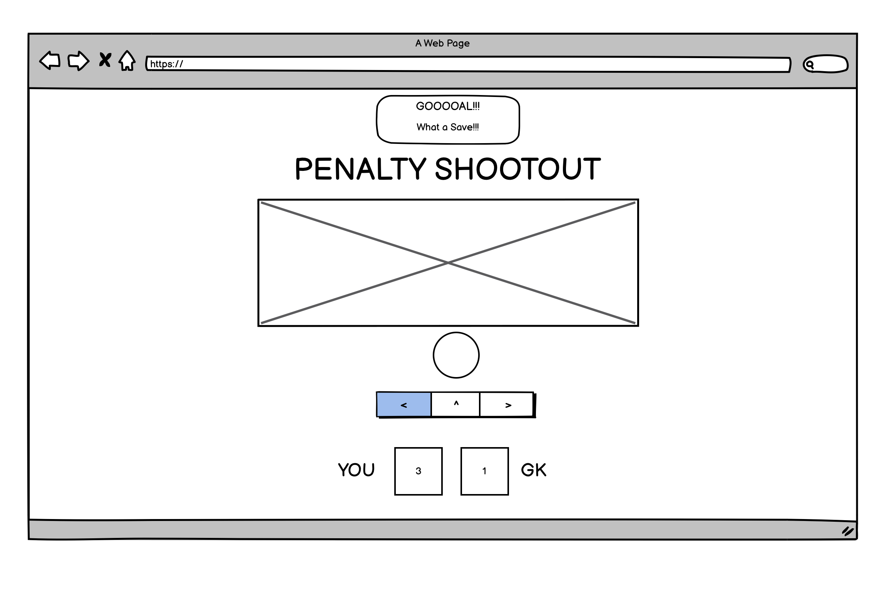
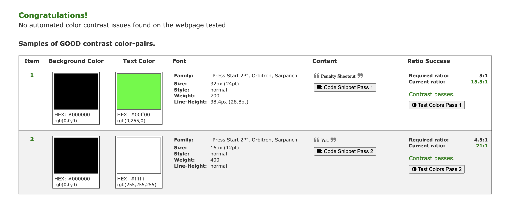

# Penalty Shootout

Penalty Shootout is a game of chance created to provide entertainment for football fans. The art style is retro arcade to provide a nostalgic feel to old school gaming whislt keeping the concept simple and easy to play. 

## Business Goals
* Provide entertainment to online users through a game of chance.
* Create a game that is easy to play and understand.
* Create a retro style game.

## User Goals
* To play the game and outscore the goalkeeper.

# UX
## Strategy 
Following the core UX principles I firstly decided on the target audience of users and I put myself in their shoes to what features I would want.

### Target Audience:
* Aged 5-30.
* Football fans.
* Enjoys playing games. 

### What the user would want from the website:
* Multiple choice.
* Element of chance.
* Score tracking. 

### This website is best for users: 
* Retro art style. 
* Simple game mechanics.
* Easy to understand and play.
* Simple asthetics.

## Scope
To achieve the strategic goals, I included the following features:
* Header with retro gaming font.
* Scoreboard with points tracker.
* Cartoon style goal and goalkeeper.
* Cartoon style retro football.
* Retro style buttons with hover effect.
* A results section.
* Responsive alert.

## Skeleton
I created wifreframes using [Balsamiq](https://balsamiq.com/). Please note the website has slightly changed since creating the wireframes.

## Surface 
The colours used for the website were chosen to acheive the goals of simplicity and retro gaming style. The green colour was used to highlight the important aspects of the website such as the main heading, result and score. The colours used passed the [Colour Contrast Accessibility Validator](https://color.a11y.com/).

I decided to use the Start Press 2P font from [Google Fonts](https://fonts.google.com/) as this provide a retro gaming style to the webpage acheiving the business goals.

A hover effect was used on the choices buttons. A scale and colour change was used to highlight the buttons and users options.